<!-- markdownlint-disable MD024 -->

# Tutorials

- [Tutorials](#tutorials)
  - [Preparation](#preparation)
  - [Image Tool](#image-tool)
    - [Generate Images](#generate-images)
      - [1. From Sidebar Panel](#1-from-sidebar-panel)
      - [2. From Tool](#2-from-tool)
    - [Edit Images](#edit-images)
    - [Generate Variation Images](#generate-variation-images)
  - [Audio Tool](#audio-tool)
    - [Transcribe Sound Strip](#transcribe-sound-strip)
      - [1. From Sidebar Panel](#1-from-sidebar-panel-1)
      - [2. From Tool](#2-from-tool-1)
    - [Transcribe Audio Data](#transcribe-audio-data)
  - [Chat Tool](#chat-tool)
    - [Chat](#chat)
      - [1. From Sidebar Panel](#1-from-sidebar-panel-2)
      - [2. From Tool](#2-from-tool-2)
    - [Ask Blender Operators/Properties](#ask-blender-operatorsproperties)
  - [Code Tool](#code-tool)
    - [Generate Code](#generate-code)
    - [Edit Code](#edit-code)
    - [Generate Code Example](#generate-code-example)
    - [Execute Code Immediately](#execute-code-immediately)

## Preparation

### Register API (Required)

This add-on requires an API key to access an OpenAI API.
You need to create an OpenAI account and get an API key from the
[OpenAI Official Site](https://openai.com/blog/openai-api).

Note that you need to pay to use an OpenAI API.
Before using this add-on, check the [Pricing Page](https://openai.com/pricing).

Once you have got an API key, enter the OpenAI API key in the add-on
preferences (a).
Click the [Check API Connection] button (b) and check if the status is OK (c).
If the status is not OK, see the error message and solve the issue.
If you are behind the proxy, input [HTTP Proxy] and [HTTPS Proxy].

You can change the other properties in the add-on preferences.

### Enable Audio Input (Optional)

Code Tool supports the audio input.
To enable the audio input, click [Enable Audio Input] button on the category
at the add-on preferences.

### Usage Statistics

You can see the statistics for the usage of the OpenAI API.

> Note: These statistics are not perfect for now. We recommend you to check the
  usage detail on the OpenAI website.

### Add-on Preferences

The add-on preferences allows you to change the behavior of the operators.

<!-- markdownlint-disable MD013 -->

|Category|Property|Description|
|---|---|---|
|System|Popup Menu Width|Width of the popup menu from workspace tools.|
||Async Execution|Execute operations asynchronously.|
||Show Status|Show request status.|
|Audio Tool|Audio Tool Model|Model to be used for Audio Tool. (Supported Model: whisper-1)|
|Chat Tool|Chat Tool Model|Model to be used for Chat Tool. (Supported Model: gpt-3.5-turbo, gpt-4, gpt-4-32k)|
||Wrap Width|Wrap width of the chat tool log|
|Code Tool|Code Tool Model|Model to be used for Code Tool. (Supported Model: gpt-3.5-turbo, gpt-4, gpt-4-32k)|
||Audio Input Configuration > Language|Language for the audio input in the code tool. This property is enabled when the audio input is enabled.|
||Recording Configuration > Format|Formats for the audio recording. This property is enabled when the audio input is enabled.|
||Recording Configuration > Channels|Channels for the audio recording. This property is enabled when the audio input is enabled.|
||Recording Configuration > Rate|Sampling rate for the audio recording. This property is enabled when the audio input is enabled.|
||Recording Configuration > Chuck Size|Frames per buffer. This property is enabled when the audio input is enabled.|
||Recording Configuration > Silence Threshold|Threshold to stop the audio recording. This property is enabled when the audio input is enabled.|
||Recording Configuration > Silence Duration Limit|The seconds to stop the audio recording. This property is enabled when the audio input is enabled.|

<!-- markdownlint-enable MD013 -->

## Image Tool

Image Tool can generate/edit an image.
Image Tool can be accessed from [OpenAI] tab on the Sidebar Panel or
from the tool [OpenAI Image Tool] in Image Editor.

### Generate Images

There are 2 ways to generate an image from a prompt.

#### 1. From Sidebar Panel

1. Go to Image Editor.
1. Open [OpenAI] tab on Sidebar.
1. Open a [Generate Image] sub-panel.
1. Change the properties.
1. Enter a prompt. (a)
1. Click the [▶] button. (b)
1. The generated image appears in the [Generated Images] sub-panel and loaded
   into the Image Editor. (c)

> Note: The generated image will be saved in `<addon_folder>/_data/image/genereated`.

|**Properties**||
|---|---|
|Size|The size of the images to generate.|
|Num|The number of images to generate.|
|Name|Name for a generated image. If [Auto] is checked, the name will be generated automatically.| <!-- markdownlint-disable-line MD013 -->

You can load a generated image into Blender or parmanently remove it from
a file.

#### 2. From Tool

1. Go to Image Editor.
1. Select the tool [OpenAI Image Tool]. (a)
1. Press the 'SPACE' key in the Image Editor, and the pop-up dialog appears. (b)
1. Enter a prompt and change the property values. (c)
1. Click the [OK] button. (d)
1. The generated image appears in the [Generated Image] sub-panel.

> Note: The generated image will be saved in `<addon_folder>/_data/image/genereated`.

|**Properties**||
|---|---|
|Size|The size of the images to generate.|
|Num|The number of images to generate.|
|Name|Name for a generated image. If [Auto] is checked, the name will be generated automatically.| <!-- markdownlint-disable-line MD013 -->

### Edit Images

#### 1. From Sidebar Panel

1. Go to Image Editor.
1. Open [OpenAI] tab on Sidebar.
1. Open a [Edit Image] sub-panel.
1. Change the properties.
1. Select a base image to be editted. Image need to have 'RGBA' color mode. (a)
1. Select a mask image to specify the area to edit. Image need to have 'RGBA'
   color mode. (b)
1. Enter a prompt to describe the edit. (c)
1. Click the [▶] button. (d)
1. The generated image appears in the [Generated Images] sub-panel. (e)

> Note: The generated image will be saved in
  `<addon_folder>/_data/image/genereated` with file name
  `edit-<Base Image Name>.png`.

|**Properties**||
|---|---|
|Size|The size of the images to generate.|
|Num|The number of images to generate.|

#### 2. From Tool

1. Go to Image Editor.
1. Select the tool [OpenAI Image Tool]. (a)
1. Press the 'SPACE' key in the Image Editor, and the pop-up dialog appears. (b)
1. Change the properties.
1. Select a base image to be editted. Image need to have 'RGBA' color mode. (c)
1. Select a mask image to specify the area to edit. Image need to have 'RGBA'
   color mode. (d)
1. Enter a prompt. (e)
1. Click the [OK] button. (f)
1. The generated image appears in the [Generated Image] sub-panel.

> Note: The generated image will be saved in
  `<addon_folder>/_data/image/genereated` with file name
  `edit-<Base Image Name>.png`.

|**Properties**||
|---|---|
|Size|The size of the images to generate.|
|Num|The number of images to generate.|

### Generate Variation Images

1. Go to Image Editor.
1. Open [OpenAI] tab on Sidebar.
1. Open a [Generate Variation Image] sub-panel.
1. Change the properties.
1. Select a base image used for generating the variation image. Image need to
   have 'RGBA' color mode. (a)
1. Click the [▶] button. (b)
1. The generated image appears in the [Generated Images] sub-panel. (c)

> Note: The generated image will be saved in
  `<addon_folder>/_data/image/genereated` with file name
  `variation-<Base Image Name>.png`.

## Audio Tool

Audio Tool can transcribe an audio data.
Audio Tool can be accessed from [OpenAI] tab on the Sidebar Panel in Sequence
Editor/Text Editor or from the tool [OpenAI Audio Tool] in Sequence Editor.

### Transcribe Sound Strip

> TODO: Write from here

There are 2 ways to transcribe a sound strip.

#### 1. From Sidebar Panel

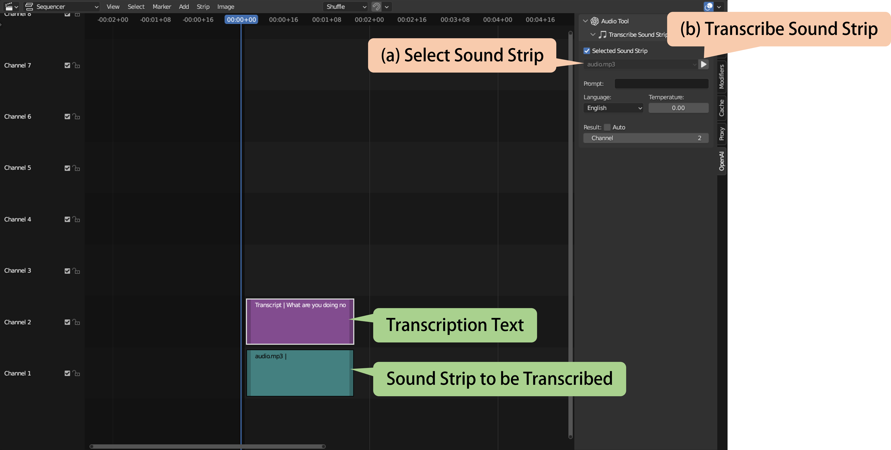

1. Go to the Sequence Editor.
1. Open [OpenAI] tab on Sidebar.
1. Open a [Transcribe Sound Strip] sub-panel.
1. Change the properties.
1. Select the sound strip to be transcribed. If you check
   [Selected Sound Strip], an active sound strip is transcribed. (a)
1. Click the [▶] button. (b)
1. The text strip with the transcription text is created on the channel.

<!-- markdownlint-disable MD013 -->

|**Properties**||
|---|---|
|Prompt|Optional text to specify the style.|
|Language|Language of the input audio.|
|Temperature|Higher value makes the output more random. Lower value makes the output more deterministic.|
|Result|Sequence channel where the transcription result to be created. If [Auto] is checked, the channel is selected automatically.|

<!-- markdownlint-enable MD013 -->

#### 2. From Tool

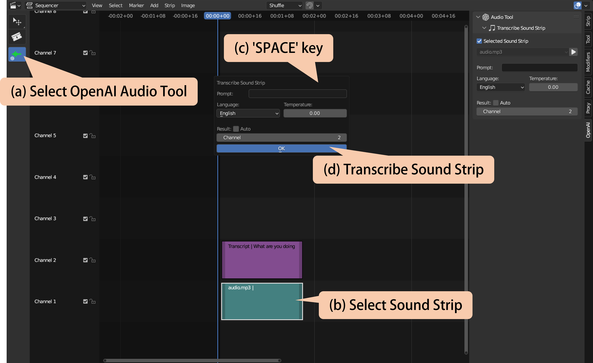

1. Go to the Sequence Editor.
1. Select the tool [OpenAI Audio Tool]. (a)
1. Select the sound strip to be transcribed. (b)
1. Press the 'SPACE' key in the Sequence Editor, and the pop-up dialog appears.
   (c)
1. Change the properties.
1. Click the [OK] button. (d)
1. The text strip with the transcription text is created on the channel.

<!-- markdownlint-disable MD013 -->

|**Properties**||
|---|---|
|Prompt|Optional text to specify the style.|
|Language|Language of the input audio.|
|Temperature|Higher value makes the output more random. Lower value makes the output more deterministic.|
|Result|Sequence channel where the transcription result to be created. If [Auto] is checked, the channel is selected automatically.|

<!-- markdownlint-enable MD013 -->

### Transcribe Audio Data

|||
|---|---|
|Editor|Text Editor|

Audio Tool can transcribe an audio data.  
There are 2 ways to transcribe an audio data.

#### 1. From Audio File

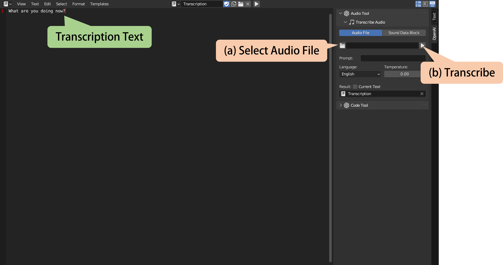

1. Go to the Text Editor.
1. Open [OpenAI] tab on Sidebar.
1. Open a [Transcribe Audio] sub-panel.
1. Change the properties.
1. Select the transcript object from [Audio File].
1. Select an audio file to be transcribed.
1. Click the [▶] button.
1. The transcription text appears in the Text Editor.

<!-- markdownlint-disable MD013 -->

|**Properties**||
|---|---|
|Prompt|Optional text to specify the style.|
|Language|Language of the input audio.|
|Temperature|Higher value makes the output more random. Lower value makes the output more deterministic.|
|Result|Name of target text block to where the transcript is
saved. If [Current Text] is checked, the transcription text appears in the current text.|

<!-- markdownlint-enable MD013 -->

#### 2. From Sound Data Block

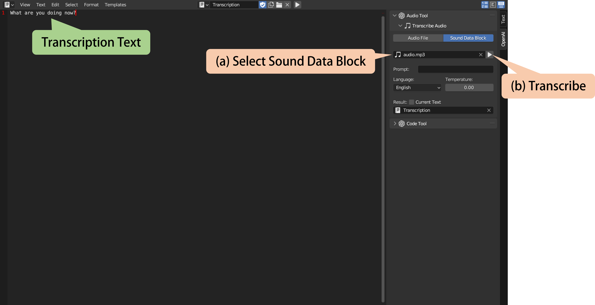

1. Go to the Text Editor.
1. Open [OpenAI] tab on Sidebar.
1. Open [Audio Tool] panel.
1. Open [Transcribe Audio] sub-panel.
1. Select [Sound Data Block].
1. Change the properties.
1. Select a sound data block to be transcribed. (a)
1. Click the [▶] button. (b)
1. The transcription text appears in the Text Editor.

<!-- markdownlint-disable MD013 -->

|**Properties**||
|---|---|
|Prompt|Optional text to specify the style.|
|Language|Language of the input audio.|
|Temperature|Higher value makes the output more random. Lower value makes the output more deterministic.|
|Result|Name of target text block to where the transcript is
saved. If [Current Text] is checked, the transcription text appears in the current text.|

<!-- markdownlint-enable MD013 -->

## Chat Tool

Chat Tool allows you to chat about Blender or ask about operators/properties.

### Chat

|||
|---|---|
|Editor|3D Viewport|

Chat Tool can be accessed from [OpenAI] tab on the Sidebar or from the tool
[OpenAI Chat Tool] in 3D Viewport.
There are 2 ways to chat.

#### 1. From Sidebar Panel

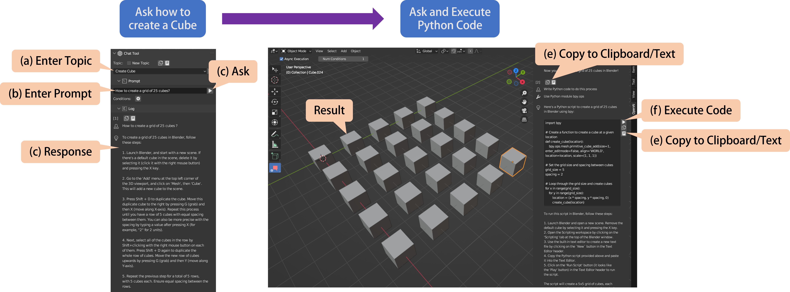

1. Go to the 3D Viewport.
1. Open the [OpenAI] tab on sidebar.
1. Open [Chat Tool] panel.
1. Select [Topic] (if [New Topic] is not checked) or input a new topic name
   (if [New Topic] is checked). If you choose an existing topic, you can
   continue chatting by using old conversations. (a)
1. Open the [Prompt] sub-panel.
1. Input a prompt and conditions (optional). (b)
1. Click the [▶] button. (c)
1. The response appears in the [Log] sub-panel. (d)

You can copy a chat log to the clipboard or to the text block. (e)
If the response contains Python code, you can execute it. (f)
You can also check the error message if the code fails to execute.

#### 2. From Tool

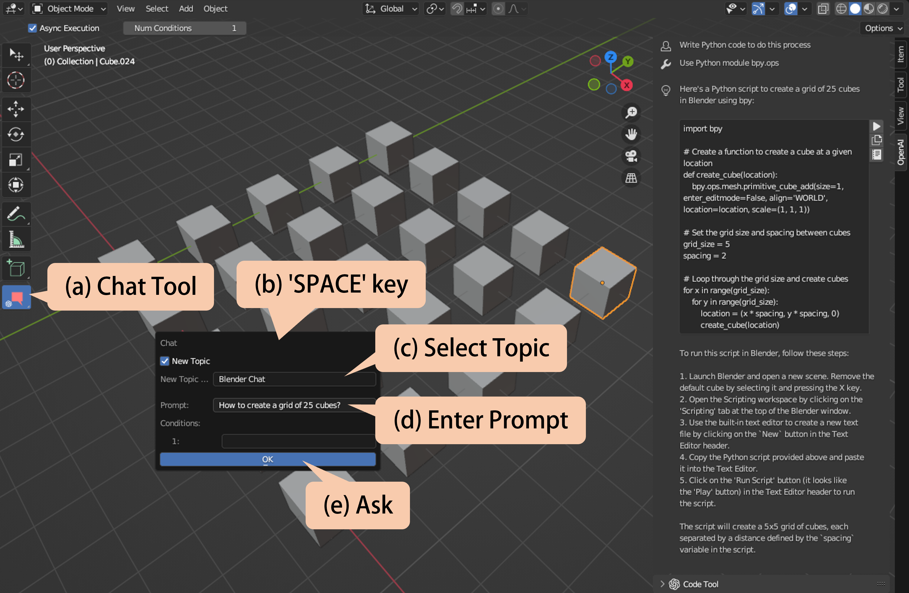

1. Go to the 3D Viewport.
1. Select the tool [OpenAI Chat Tool]. (a)
1. Set [Number of Conditions] in the tool setting if you want to add additional
   conditions (optional).
1. Press the 'SPACE' key in the 3D Viewport, and the pop-up dialog appears. (b)
1. Select [Topic] (if [New Topic] is not checked) or input a new topic name
   (if [New Topic] is checked). If you choose an existing topic, you can
   continue to chat by using old conversations. (c)
1. Enter a prompt and conditions (optional). (d)
1. Click the [OK] button. (e)
1. The response appears in the [Log] sub-panel.

You can copy a chat log to the clipboard or to text.
If the response contains Python code, you can execute it directly.
You can also check the error message if the code fails to execute.

### Ask Blender Operators/Properties

|||
|---|---|
|Editor|All|

Chat Tool supports asking Blender operators/properties from right-click menu.

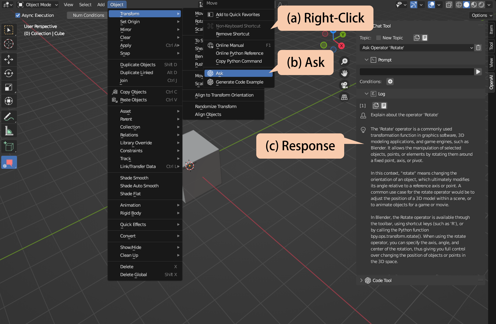

1. Move the mouse cursor to menu/panel items.
1. Right-click and the menu appears. (a)
1. When the mouse cursor is over the operator/property, you can execute
   [Ask]. (b)
1. When executed, the new topic is automatically started.
1. The response appears in the [Log] sub-panel. (c)

## Code Tool

Code Tool allows you to generate a Python code with Blender Python API.

### Generate Code

|||
|---|---|
|Editor|Text Editor|

Code tool can generate a Python code and display in the Text Editor.

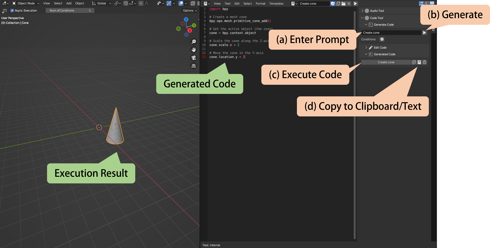

1. Go to the Text Editor.
1. Open the [OpenAI] tab on sidebar.
1. Open [Code Tool] panel.
1. Open [Genereate Code] sub-panel.
1. Input a prompt and conditions (optional). (a)
1. Click the [▶] button. (b)
1. Generated code can be listed on the text block.

You can execute the generated code or copy it to the text block from
[Genereated Code] sub-panel. (c)(d)
You can also check the error message if the code fails to execute.

### Edit Code

|||
|---|---|
|Editor|Text Editor|

Code tool can edit a Python code on the text block.

1. Go to the Text Editor
1. Open the [OpenAI] tab on sidebar.
1. Open [Code Tool] panel.
1. Open [Edit Code] sub-panel.
1. Select the text block whose code to be editted. (a)
1. Input a prompt and conditions (optional). (b)
1. Click the [▶] button. (c)
1. Generated code can be displayed to a new text block with the name
   `edit-<original_text_block>`.

You can execute the generated code or copy it to the text block from
[Genereated Code] sub-panel. (d)(e)
You can also check the error message if the code fails to execute.

### Generate Code Example

|||
|---|---|
|Editor|All|

Code Tool supports generating the code example that uses Blender Python API of
operators/properties from right-click menu.

1. Move the mouse cursor to menu/panel items.
1. Right-click and the menu appears.
1. When the mouse cursor is over the operator/property, you can execute
   [Generate Code Example]. (b)
1. When executed, the generated code can be displayed to a new text block with
   the name `[Example] <python_api>`.

You can execute the generated code or copy it to the text block from
[Genereated Code] sub-panel.
You can also check the error message if the code fails to execute.

### Execute Code Immediately

Code Tool can execute the genereated code from the prompt or audio input.
There are 4 ways to do this.

#### 1. Execute Code from Sidebar Panel (Prompt)

|||
|---|---|
|Editor|3D Viewport|

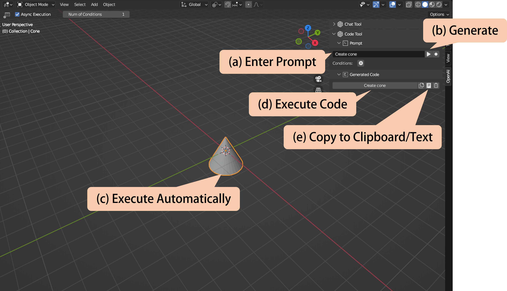

1. Go to the 3D Viewport.
1. Open the [OpenAI] tab on sidebar.
1. Open [Code Tool] panel.
1. Open [Prompt] sub-panel.
1. Input a prompt and conditions (optional). (a)
1. Click the [▶] button. (b)
1. Generated code is executed. (c)

You can execute the generated code or copy it to the text block from
[Genereated Code] sub-panel. (d)(e)
You can also check the error message if the code fails to execute.

#### 2. Execute Code from Sidebar Panel (Audio Input)

|||
|---|---|
|Editor|3D Viewport|

1. Go to the 3D Viewport.
1. Open the [OpenAI] tab on sidebar.
1. Open [Code Tool] panel.
1. Input a conditions (optional).
1. Click the [●] button. (a)
1. Speak to the microphone what code you want to execute. Press 'ESC' key to
   cancel. (b)
1. Generated code is executed. (c)

You can execute the generated code or copy it to the text block from
[Genereated Code] sub-panel.
You can also check the error message if the code fails to execute.

#### 3. Execute Code from Tool (Prompt)

|||
|---|---|
|Editor|3D Viewport|

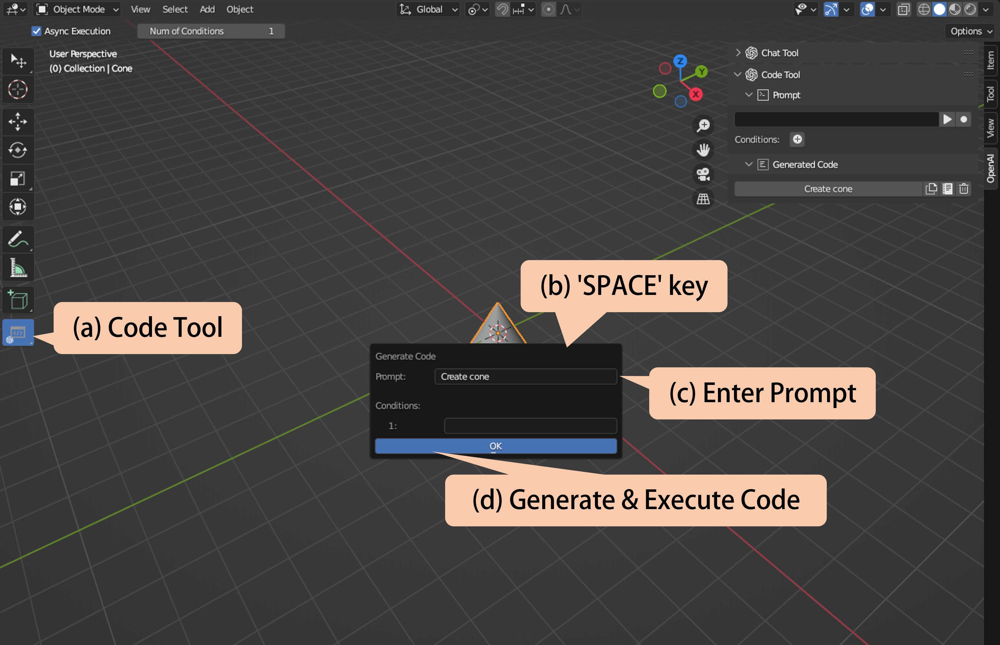

1. Go to the 3D Viewport.
1. Select the tool [OpenAI Code Tool]. (a)
1. Set [Number of Conditions] in the tool setting if you want to add additional
   conditions (optional).
1. Press the 'SPACE' key in the 3D Viewport, and the pop-up dialog appears. (b)
1. Enter a prompt and conditions (optional). (e)
1. Click the [OK] button. (d)
1. Generated code is executed.

You can execute the generated code or copy it to the text block from
[Genereated Code] sub-panel on [Code Tool] panel.
You can also check the error message if the code fails to execute.

#### 4. Execute Code from Tool (Audio Input)

|||
|---|---|
|Editor|3D Viewport|

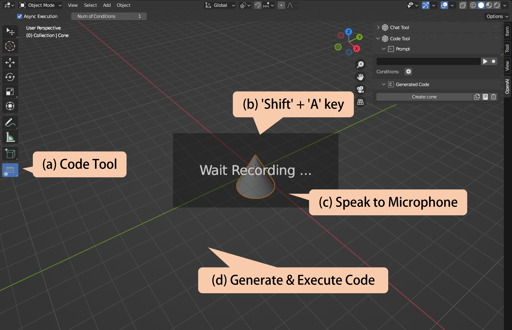

1. Go to the 3D Viewport.
1. Select the tool [OpenAI Code Tool]. (a)
1. Set [Number of Conditions] in the tool setting if you want to add additional
   conditions (optional).
1. Press 'Shift' + 'A' key in the 3D Viewport. (b)
1. Speak to the microphone what code you want to execute. Press 'ESC' key to
   cancel. (c)
1. Generated code is executed. (d)

You can execute the generated code or copy it to the text block from
[Genereated Code] sub-panel on [Code Tool] panel.
You can also check the error message if the code fails to execute.
